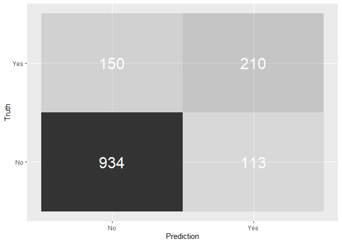

Modelling with Tidymodels and Parsnip - A Tidy Approach to a
Classification Problem
================
Daniel James
2022-03-25

``` r
knitr::opts_chunk$set(echo = TRUE,
                      comment = "",
                      collapse = TRUE,
                      #echo = FALSE,
                      error = TRUE, # do not interrupt in case of errors
                      message = FALSE,
                      warning = FALSE,
                      comma = function(x) format(x, digits = 2, big.mark = ",")
)
#Load packages and prepare multicore process
library(pacman)
p_load(nortest)
p_load(moments)
p_load(tseries)
p_load(PoweR)
p_load(AMR)
p_load(tsoutliers)
p_load(lawstat)
p_load(dgof)
p_load(nortest)
p_load(DescTools)
```

[Here](https://www.linkedin.com/pulse/modelling-tidymodels-parsnip-tidy-approach-problem-diego-usai/)

parsnip is the brainchild of RStudio’s **Max Khun** (of caret fame) and
Davis Vaughan and forms part of tidymodels, a growing ensemble of tools
to explore and iterate modelling tasks that shares a common philosophy
(and a few libraries) with the tidyverse.

Although there are a number of packages at different stages in their
development, I have decided to take tidymodels “for a spin”, so to
speak, and create and execute a “tidy” modelling workflow to tackle a
classification problem. My aim is to show how easy it is to fit a simple
logistic regression in R’s glm and quickly switch to a cross-validated
random forest using the ranger engine by changing only a few lines of
code.

For this post in particular I’m focusing on four different libraries
from the tidymodels suite: - rsample for data sampling and
cross-validation, - recipes for data preprocessing, - parsnip for model
set up and estimation, and - yardstick for model assessment.

Note that the focus is on modelling workflow and libraries interaction.
For that reason, I am keeping data exploration and feature engineering
to a minimum.

\##Set up First, I load the packages I need for this analysis.

``` r
library(tidymodels)
library(skimr)
library(tibble)
library(knitr)
```

For this project I am using the Telco Customer Churn from
<https://www.kaggle.com/blastchar/telco-customer-churn> , one of IBM
Analytics Communities. The data contains 7,043 rows, each representing a
customer, and 21 columns for the potential predictors, providing
information to forecast customer behaviour and help develop focused
customer retention programmes.

Churn is the Dependent Variable and shows the customers who left within
the last month. The dataset also includes details on the Services that
each customer has signed up for, along with Customer Account and
Demographic information.

``` r
telco <- readr::read_csv("WA_Fn-UseC_-Telco-Customer-Churn.csv")
telco |> skimr::skim()
```

|                                                  |       |
|:-------------------------------------------------|:------|
| Name                                             | telco |
| Number of rows                                   | 7043  |
| Number of columns                                | 21    |
| \_\_\_\_\_\_\_\_\_\_\_\_\_\_\_\_\_\_\_\_\_\_\_   |       |
| Column type frequency:                           |       |
| character                                        | 17    |
| numeric                                          | 4     |
| \_\_\_\_\_\_\_\_\_\_\_\_\_\_\_\_\_\_\_\_\_\_\_\_ |       |
| Group variables                                  | None  |

Data summary

**Variable type: character**

| skim_variable    | n_missing | complete_rate | min | max | empty | n_unique | whitespace |
|:-----------------|----------:|--------------:|----:|----:|------:|---------:|-----------:|
| customerID       |         0 |             1 |  10 |  10 |     0 |     7043 |          0 |
| gender           |         0 |             1 |   4 |   6 |     0 |        2 |          0 |
| Partner          |         0 |             1 |   2 |   3 |     0 |        2 |          0 |
| Dependents       |         0 |             1 |   2 |   3 |     0 |        2 |          0 |
| PhoneService     |         0 |             1 |   2 |   3 |     0 |        2 |          0 |
| MultipleLines    |         0 |             1 |   2 |  16 |     0 |        3 |          0 |
| InternetService  |         0 |             1 |   2 |  11 |     0 |        3 |          0 |
| OnlineSecurity   |         0 |             1 |   2 |  19 |     0 |        3 |          0 |
| OnlineBackup     |         0 |             1 |   2 |  19 |     0 |        3 |          0 |
| DeviceProtection |         0 |             1 |   2 |  19 |     0 |        3 |          0 |
| TechSupport      |         0 |             1 |   2 |  19 |     0 |        3 |          0 |
| StreamingTV      |         0 |             1 |   2 |  19 |     0 |        3 |          0 |
| StreamingMovies  |         0 |             1 |   2 |  19 |     0 |        3 |          0 |
| Contract         |         0 |             1 |   8 |  14 |     0 |        3 |          0 |
| PaperlessBilling |         0 |             1 |   2 |   3 |     0 |        2 |          0 |
| PaymentMethod    |         0 |             1 |  12 |  25 |     0 |        4 |          0 |
| Churn            |         0 |             1 |   2 |   3 |     0 |        2 |          0 |

**Variable type: numeric**

| skim_variable  | n_missing | complete_rate |    mean |      sd |    p0 |    p25 |     p50 |     p75 |    p100 | hist  |
|:---------------|----------:|--------------:|--------:|--------:|------:|-------:|--------:|--------:|--------:|:------|
| SeniorCitizen  |         0 |             1 |    0.16 |    0.37 |  0.00 |   0.00 |    0.00 |    0.00 |    1.00 | ▇▁▁▁▂ |
| tenure         |         0 |             1 |   32.37 |   24.56 |  0.00 |   9.00 |   29.00 |   55.00 |   72.00 | ▇▃▃▃▆ |
| MonthlyCharges |         0 |             1 |   64.76 |   30.09 | 18.25 |  35.50 |   70.35 |   89.85 |  118.75 | ▇▅▆▇▅ |
| TotalCharges   |        11 |             1 | 2283.30 | 2266.77 | 18.80 | 401.45 | 1397.47 | 3794.74 | 8684.80 | ▇▂▂▂▁ |

There are a couple of things to notice here:

customerID is a unique identifier for each row. As such it has no
descriptive or predictive power and it needs to be removed.

Given the relative small number of missing values in TotalCharges (only
11 of them) I am dropping them from the dataset.

``` r
telco <- telco |>
  select(-customerID) |>
  drop_na()
```

There are couples of things one can observed from above: The tibble:
7,032 x 20 is only printed in part( 10 x 8)

One may use the bellow command to print every part of the tibble

**Note**: I have not revealed the print here as I use **include =
FALSE**.

# Modelling with tidymodels

To show the basic steps in the tidymodels framework I am fitting and
evaluating a simple logistic regression model.

## Train and test split

rsample provides a streamlined way to create a randomised training and
test split of the original data.

``` r
set.seed(seed = 1972) 

train_test_split <- rsample::initial_split(
    data = telco,     
    prop = 0.80   
  ) 
train_test_split
<Analysis/Assess/Total>
<5625/1407/7032>
```

Of the 7,043 total customers, 5,626 have been assigned to the training
set and 1,406 to the test set. I save them as train_tbl and test_tbl.

``` r
train_tbl <- train_test_split |> training() 
test_tbl  <- train_test_split |> testing()
```

# A simple recipe

The recipes package uses a cooking metaphor to handle all the data
preprocessing, like missing values imputation, removing predictors,
centring and scaling, one-hot-encoding, and more.

First, I create a recipe where I define the transformations I want to
apply to my data. In this case I create a simple recipe to change all
character variables to factors.

Then, I “prep the recipe” by mixing the ingredients with prep. Here I
have included the prep bit in the recipe function for brevity.

``` r
recipe_simple <- function(dataset) {
  recipe(Churn ~ ., data   = dataset) |>
    step_string2factor(all_nominal(), -all_outcomes()) |>
    prep(data = dataset)
}
```

**Note that**: in order to avoid data leakage (e.g: transferring
information from the train set into the test set), data should be
“prepped” using the train_tbl only.

``` r
recipe_prepped <- recipe_simple(dataset = train_tbl)
```

Finally, to continue with the cooking metaphor, I “bake the recipe” to
apply all preprocessing to the data sets.

``` r
train_baked <- bake(recipe_prepped, new_data = train_tbl)
test_baked  <- bake(recipe_prepped, new_data = test_tbl)
```

# Fit the model

\#parsnip is a relatively recent addition to the tidymodels suite and is
probably the one I like best. This package offers a unified API that
allows access to several machine learning packages without the need to
learn the syntax of each individual one.

With 3 simple steps you can:

-   set the type of model you want to fit (here is a logistic
    regression) and its mode (classification)
-   decide which computational engine to use (glm in this case)
-   spell out the exact model specification to fit (I’m using all
    variables here) and what data to use (the baked train dataset)

``` r
logistic_glm <- logistic_reg(mode = "classification") |>
  set_engine("glm") |>
  fit(Churn ~ ., data = train_baked)
```

If you want to use another engine you can simply switch the set_engine
argument (for logistic regression you can choose from glm, glmnet, stan,
spark, and keras) and parsnip will take care of changing everything else
for you behind the scenes.

\##Performance assessment

The yardstick package provides an easy way to calculate several
assessment measures. But before I can evaluate my model’s performance, I
need to calculate some predictions by passing the test_baked data to the
predict function.

``` r
predictions_glm <- logistic_glm |>
  predict(new_data = test_baked) |>
  bind_cols(test_baked |> select(Churn)) 
head(predictions_glm)
# A tibble: 6 x 2
  .pred_class Churn
  <fct>       <fct>
1 Yes         Yes  
2 No          Yes  
3 No          No   
4 No          Yes  
5 No          Yes  
6 Yes         No   
```

There are several metrics that can be used to investigate the
performance of a classification model but for simplicity I’m only
focusing on a selection of them: accuracy, precision, recall and
F1_Score.

All of these measures (and many more) can be derived by the Confusion
Matrix, a table used to describe the performance of a classification
model on a set of test data for which the true values are known.

In and of itself, the confusion matrix is a relatively easy concept to
get your head around as is shows the number of false positives, false
negatives, true positives, and true negatives. However some of the
measures that are derived from it may take some reasoning with to fully
understand their meaning and use.

``` r
predictions_glm |>
  conf_mat(Churn, .pred_class) |>
  pluck(1) |>
  as_tibble() |>
  ggplot(aes(Prediction, Truth, alpha = n)) +
  geom_tile(show.legend = FALSE) +
  geom_text(aes(label = n), colour = "white", alpha = 1, size = 8)
```

<!-- -->

The model’s **Accuracy** is the fraction of predictions the model got
right and can be easily calculated by passing the *predictions_glm* to
the metrics function. However, accuracy is not a very reliable metric as
it will provide misleading results if the data set is unbalanced.

With only basic data manipulation and feature engineering the simple
logistic model has achieved 80% accuracy.

``` r
predictions_glm |>
  metrics(Churn, .pred_class) |>
  select(-.estimator) |>
  filter(.metric == "accuracy")
# A tibble: 1 x 2
  .metric  .estimate
  <chr>        <dbl>
1 accuracy     0.813
```

**Precision** shows how sensitive models are to False Positives
(i.e. predicting a customer is leaving when he-she is actually staying)
whereas **Recall** looks at how sensitive models are to False Negatives
(i.e. forecasting that a customer is staying whilst he-she is in fact
leaving).

These are very relevant business metrics because organisations are
particularly interested in accurately predicting which customers are
truly at risk of leaving so that they can target them with retention
strategies. At the same time they want to minimising efforts of
retaining customers incorrectly classified as leaving who are instead
staying.

``` r
tibble("precision" = precision(predictions_glm, Churn, .pred_class) |>
    select(.estimate), "recall" = recall(predictions_glm, Churn, .pred_class) |>
    select(.estimate)) |>
  unnest() |>
  kable()
```

| .estimate | .estimate1 |
|----------:|-----------:|
| 0.8616236 |  0.8920726 |

Another popular performance assessment metric is the **F1 Score**, which
is the harmonic average of the precision and recall. An F1 score reaches
its best value at 1 with perfect precision and recall.

``` r
predictions_glm |>
  f_meas(Churn, .pred_class) |>
  select(-.estimator) |>
  kable()
```

| .metric | .estimate |
|:--------|----------:|
| f_meas  | 0.8765838 |

# A Random Forest

This is where the real beauty of tidymodels comes into play. Now I can
use this tidy modelling framework to fit a **Random Forest** model with
the ranger engine.

## Cross-validation set up

To further refine the model’s predictive power, I am implementing a
**10-fold cross validation** using *vfold_cv* from rsample, which splits
again the initial training data.

``` r
cross_val_tbl <- vfold_cv(train_tbl, v = 10)cross_val_tbl
Error: <text>:1:45: unexpected symbol
1: cross_val_tbl <- vfold_cv(train_tbl, v = 10)cross_val_tbl
                                                ^
```

If we take a further look, we should recognise the 5,626 number, which
is the total number of observations in the initial train_tbl. In each
round, 563 observations will in turn be retained from estimation and
used to validate the model for that fold.

``` r
cross_val_tbl$splits |>
  pluck(1)
Error in pluck(cross_val_tbl$splits, 1): object 'cross_val_tbl' not found
```

To avoid confusion and distinguish the initial train/test splits from
those used for cross validation, the author of rsample **Max Kuhn** has
coined two new terms: the analysis and the assessment sets. The former
is the portion of the train data used to recursively estimate the model,
where the latter is the portion used to validate each estimate.

## Update the recipe

**NOTE** that a random forest needs all numeric variables to be centred
and scaled and all character/factor variables to be “dummified”. This is
easily done by updating the recipe with these transformations.

``` r
recipe_rf <- function(dataset) {
  recipe(Churn ~ ., data   = dataset) |>
    step_string2factor(all_nominal(), -all_outcomes()) |>
    step_dummy(all_nominal(), -all_outcomes()) |>
    step_center(all_numeric()) |>
    step_scale(all_numeric()) |>
    prep(data = dataset)
}
```

# Estimate the model

Switching to another model could not be simpler! All I need to do is to
change the **type of model** to *random_forest* and add its
hyper-parameters, change the **set_engine** argument to ranger and I’m
ready to go.

I’m bundling all steps into a function that estimates the model across
all folds, runs predictions and returns a convenient tibble with all the
results. I need to add an extra step before the recipe “prepping” to
maps the cross validation splits to the analysis and assessment
functions. This will guide the iterations through the 10 folds.

``` r
rf_fun <- function(split, id, try, tree) {
  
  analysis_set <- split |> analysis()
  analysis_prepped <- analysis_set |> recipe_rf()
  analysis_baked <- analysis_prepped |> bake(new_data = analysis_set)
  
  model_rf <-
    rand_forest(
      mode  = "classification",
      mtry  = try,
      trees = tree
    ) |>
    set_engine("ranger",
               importance = "impurity"
    ) |>
    fit(Churn ~ ., data = analysis_baked)  
  
  assessment_set     <- split |> assessment()
  assessment_prepped <- assessment_set |> recipe_rf()
  assessment_baked   <- assessment_prepped |> 
    bake(new_data = assessment_set)  
  
  tibble(
    "id"         = id,
    "truth"      = assessment_baked$Churn,
    "prediction" = model_rf |>
      predict(new_data = assessment_baked) |>
      unlist()
  )
  
}
```

# Performance assessment

All I have left to do is mapping the formula to a data frame.

``` r
pred_rf <- map2_df(
  .x = cross_val_tbl$splits,
  .y = cross_val_tbl$id,
  ~ rf_fun(split = .x, id = .y, try = 3, tree = 200)
)
Error in map2(.x, .y, .f, ...): object 'cross_val_tbl' not found
head(pred_rf)
Error in head(pred_rf): object 'pred_rf' not found
```

I’ve found that yardstick has a very handy confusion matrix summary
function, which returns an array of **13 different metrics** but in this
case I want to see the four I used for the glm model.

``` r
pred_rf |>
  conf_mat(truth, prediction) |>
  summary() |>
  select(-.estimator) |>
  filter(.metric %in%
           c("accuracy", "precision", "recall", "f_meas")) |>
  kable()
Error in conf_mat(pred_rf, truth, prediction): object 'pred_rf' not found
```

The random forest model is performing in par with the simple logistic
regression. Given the very basic feature engineering that I’ve carried
out, there is scope to further improve the model but this is beyond the
scope of this post.

# Closing considerations

One of the great advantage of tidymodels is the flexibility and ease of
access to every phase of the analysis workflow. Creating the modelling
pipeline is a breeze and you can easily re-use the initial framework by
changing model type with parsnip and data pre-processing with recipes
and in no time you’re ready to check your new model’s performance with
yardstick.

In any analysis you would typically audit several models and parsnip
frees you up from having to learn the unique syntax of every modelling
engine so that you can focus on finding the best solution for the
problem at hand.
